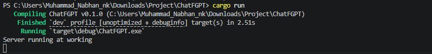

# ChatFGPT (Chat fake GPT)

A fake version chatgpt. this project for Fun :)

Live website: [https://chatfgpt.onrender.com](https://chatfgpt.onrender.com/)


## Overview

This repo conatins the source code of website and rust.

The site includes:
- user can Chat models
- hack club api
- small animtion
- safe


## Tech stack

- HTML5
- CSS3
- Vanila JS
- Rust (main)


## Repository structure

| Path | Description |
| --- | --- |
| [`index.html`](./index.html) | Main projects page |
| [`style.css`](./main.css) | Global style |
| [`script.js`](./script.js) | for animtion and communicat with back end rust |
| [`journal.md`](./journal.md) | Project update log |


## Running localy if you don't want to use the [link](https://chatfgpt.onrender.com/)
Quick Start

```bash
cargo run
```

For an optimized binary:

```bash
cargo build --release
```

### demo release comming soon


## Project journal ( comming)

To follow major updates and milestones, see [`journal.md`](./journal.md).


## Screenshots

