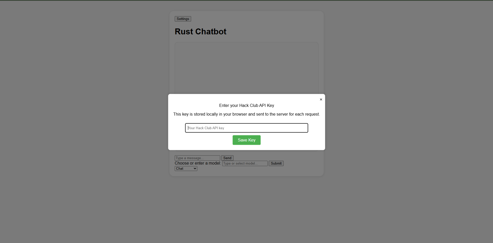
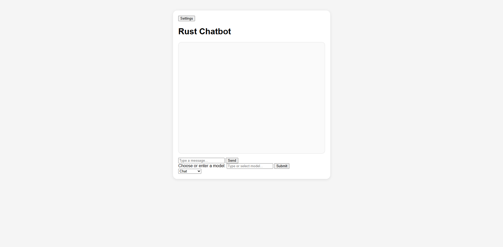
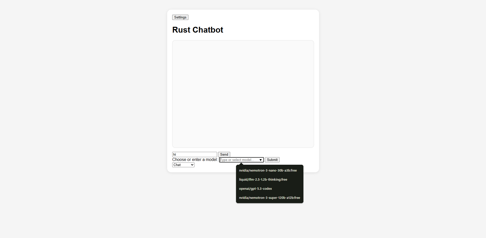
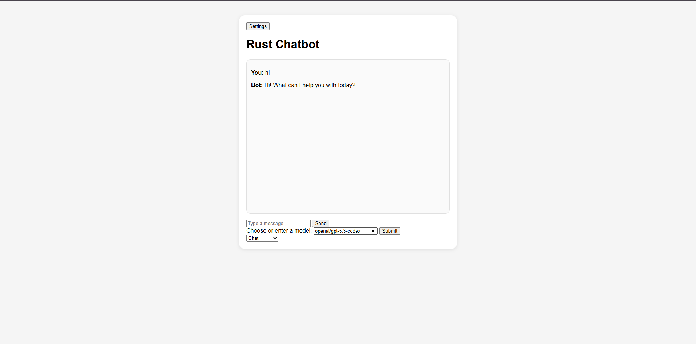
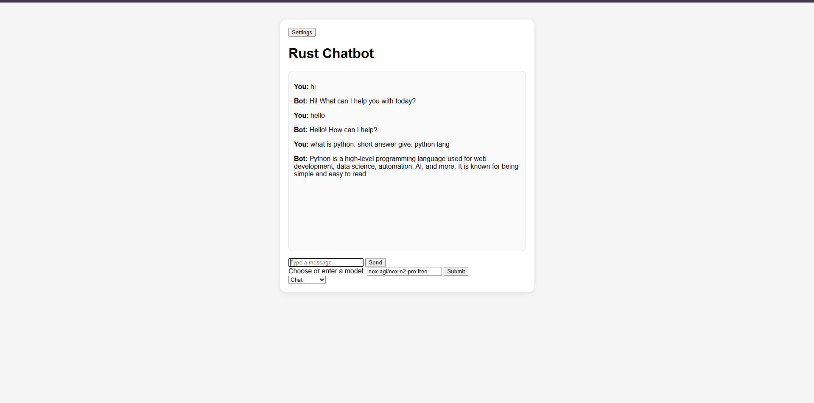
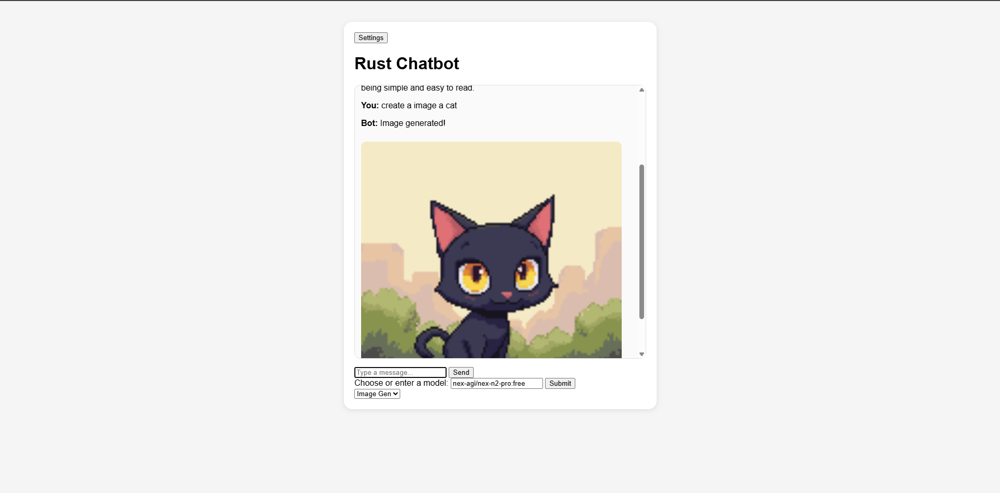

## ChatFGPT (Chat Fake GPT)
##### intro
This is a fake GPT and using hack club api and using rust language.

## My tech stack
- Rust
- HTML
- CSS
- JavaScript
- hack club api
- rust lib

## Why i start this project?

this is made for fun. just a practice for me to learn rust and html, css, javascript.

## Demo

## thankyou for reading my journal.md